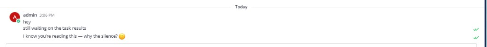
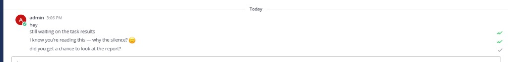
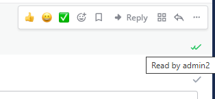

# Message Status — Mattermost Plugin

WhatsApp/Telegram-style delivery and read receipts for your own messages: one gray checkmark for **Delivered**, two green checkmarks for **Read**.

> **Disclaimer:** This plugin was created with AI assistance (Cursor). It is provided as-is, without warranty. **Use at your own discretion** — review the code and test in your environment before production use.

## Screenshots

Read receipts update in real time — green double ticks (✓✓) when the recipient opens your message in the web client.



Gray tick (✓) = **Delivered**. Green ticks (✓✓) = **Read**. Status is shown only on your own messages.



Hover a tick to see who read your message.



## Features

- **Delivered (✓)** — gray tick (`#9CA3AF`) when the message is persisted and available to recipients
- **Read (✓✓)** — green ticks (`#22C55E`) when a recipient scrolls the message into view (~50% visible)
- **Direct messages** — delivered when the other user is online; read when they view the message
- **Channels / groups (MVP)** — delivered after create; read when any member views the post in the viewport
- **Real-time updates** — server plugin broadcasts status changes over WebSocket
- **Own messages only** — ticks appear only on posts you authored (not system, deleted, or ephemeral posts)

## Limitations

- **Web client only** — checkmarks and read tracking run in the Mattermost webapp plugin. Mobile and desktop apps do not load plugin UI and do not call the read API.
- **Delivered (✓)** works for all clients (server hook on post create).
- **Read (✓✓)** is detected only when the recipient views the message in the **web client** (viewport / open thread).

## Requirements

- Mattermost **9.0+** (tested with 10.x)
- Node.js **18+** and npm (webapp build)
- Go **1.22+** (server plugin build)

## Build

```bash
make dist
```

Creates a **Linux-only** bundle (~24 MB) using a Go bundler that writes a Mattermost-compatible tar structure:

```
dist/com.github.mattermost-message-status-1.0.4.tar.gz
```

For all platforms (linux + darwin + windows, ~61 MB — may require raising `FileSettings.MaxFileSize`):

```bash
make dist-all
```

Other commands:

```bash
make webapp      # build webapp only
make server-linux # build Linux server binaries only
make clean       # remove build artifacts
```

## Install

### System Console

1. **System Console → Plugins → Plugin Management**
2. Enable **Enable Plugins** and **Enable Uploads**
3. Upload `dist/com.github.mattermost-message-status-1.0.4.tar.gz`
4. Enable **Message Status**

### mmctl

```bash
mmctl plugin upload dist/com.github.mattermost-message-status-1.0.4.tar.gz
mmctl plugin enable com.github.mattermost-message-status
```

Reload the Mattermost web client after installation (**Ctrl+F5**).

## How it works

### Webapp

- `MessageStatusPortals` — appends tick UI into each own post body (text, images, custom post types) at the bottom-right
- `PostReadTracker` — uses `IntersectionObserver` to call the server when another user's post becomes visible
- Redux store — caches per-post status for instant UI updates
- WebSocket handler — listens for `status_updated` events from the server plugin

### Server (Go)

- **KV store** — persists delivery/read state per post
- **HTTP API**
  - `POST /plugins/com.github.mattermost-message-status/api/v1/read` — mark a post as read
  - `GET /plugins/com.github.mattermost-message-status/api/v1/status?post_ids=...` — bulk status lookup
- **WebSocket** — `PublishWebSocketEvent("status_updated", ...)` to the post author
- **Hook** — `MessageHasBeenPosted` marks new user posts as delivered

## Project layout

```
├── plugin.json
├── Makefile
├── images/           # README screenshots
├── server/           # Go plugin (KV + API + WebSocket)
│   ├── main.go
│   ├── plugin.go
│   └── api.go
└── webapp/           # React/TypeScript client
    └── src/
        ├── components/
        ├── actions/
        ├── reducers/
        └── styles/
```

## Forking

Update the plugin ID in:

- `plugin.json`
- `webapp/src/manifest.ts`
- `webapp/src/types/store.ts` (`PLUGIN_STATE_KEY`)
- `Makefile`

## License

MIT — see [LICENSE](LICENSE).
